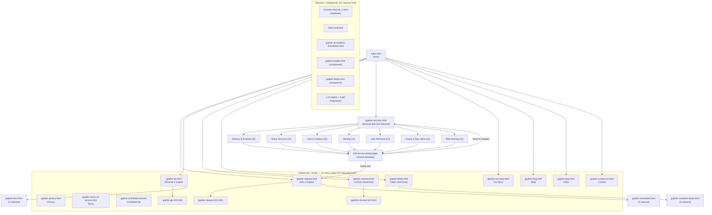

# Page Inventory & Sitemap — Gopher Marketplace

_Generated: 2026-06-24 · Read-only audit — no pages were modified._

**134 HTML files** in `Final/` (the GitHub Pages site root):
- **19** core / brand / legal pages
- **108** service-detail pages (one shared template family)
- **7** components & fragments (not standalone pages)

Inbound-link counts come from scanning every page's `href`s (including the static
links inside the JS-injected shared header/footer). The 15 pages showing **127
inbound** are the ones embedded in that shared nav/footer, so virtually every page
links to them.

## Orphan pages (no inbound `href` from any other page)

| File | Orphan type | Notes |
|---|---|---|
| [`e-waste-removal_1.html`](Final/e-waste-removal_1.html) | ⚠️ **Real orphan** | Near-duplicate of `e-waste-removal.html` (see Duplicates). Not in the services grid — looks like a leftover copy. |
| [`gopher-header.html`](Final/gopher-header.html) | Expected | Shared header **component**, injected via JS — not meant to be linked directly. |
| [`gopher-footer.html`](Final/gopher-footer.html) | Expected | Shared footer **component** — not meant to be linked directly. |
| [`gopher-iq-sandbox-standalone.html`](Final/gopher-iq-sandbox-standalone.html) | Expected | Standalone demo/sandbox of the "gopher iQ" engine; intentionally not in nav. |
| [`refer-card.html`](Final/refer-card.html) | Expected | Small "Refer a driver" card fragment. |
| [`1-engine-css-block.html`](Final/1-engine-css-block.html) | Expected | Code fragment (CSS block), not a page. |
| [`2-engine-js-block.html`](Final/2-engine-js-block.html) | Expected | Code fragment (JS block), not a page. |
| [`4-pill-markup.html`](Final/4-pill-markup.html) | Expected | Code fragment (markup snippet), not a page. |

Only **`e-waste-removal_1.html`** is a genuine orphan worth resolving; the rest are
intentional shared components or code snippets, not navigable pages.

---

## Full inventory

### A. Core, brand & legal pages

| File | Title | Purpose | Size | Linked by |
|---|---|---|---|---|
| [`gopher-blog.html`](Final/gopher-blog.html) | Gopher Blog — Field notes from the neighborhood | Blog landing — field-notes / article listing. | 1.3 MB | **127** — global nav + footer |
| [`gopher-connect-101.html`](Final/gopher-connect-101.html) | Gopher Connect Tutorial | Tutorial / walkthrough for Gopher Connect (business workforce product). | 194.9 KB | **127** — global nav + footer |
| [`gopher-connect.html`](Final/gopher-connect.html) | Gopher Connect – On-Demand Workforce for Businesses | Product page — Gopher Connect, on-demand workforce for businesses. | 5.2 MB | **127** — global nav + footer |
| [`gopher-contact-us.html`](Final/gopher-contact-us.html) | Contact Us – Gopher | Contact & support hub (links to Request and Go support). | 154.3 KB | **127** — global nav + footer |
| [`gopher-customer-deals.html`](Final/gopher-customer-deals.html) | Gopher Deals – Save on Local Deals, Delivered to Your Door | Customer-facing variant of the Deals page (local-deals map). Linked from a few pages, not global nav. | 4.9 MB | 5 — `gopher-connect.html`, `gopher-go-101.html`, `gopher-go.html`, `gopher-request.html`, `index.html` |
| [`gopher-deals.html`](Final/gopher-deals.html) | Gopher Deals – Local Merchant & Provider Offers | Deals page for merchants / providers; embeds a Leaflet map. | 7.3 MB | **127** — global nav + footer |
| [`gopher-faqs.html`](Final/gopher-faqs.html) | FAQs – Gopher | Frequently asked questions. | 461.5 KB | **127** — global nav + footer |
| [`gopher-go-101.html`](Final/gopher-go-101.html) | Gopher Go 101 | Tutorial / walkthrough for Gopher Go (provider onboarding). | 426.1 KB | **127** — global nav + footer |
| [`gopher-go.html`](Final/gopher-go.html) | Become a Service Provider – Gopher Go | Landing — Become a service provider (Gopher Go). | 675.3 KB | **127** — global nav + footer |
| [`gopher-our-story.html`](Final/gopher-our-story.html) | Our Story | Gopher — It started with a beer run. | About / brand story page. | 1.7 MB | **127** — global nav + footer |
| [`gopher-privacy.html`](Final/gopher-privacy.html) | Privacy Policy – Gopher | Privacy Policy (legal). | 169.4 KB | **127** — global nav + footer |
| [`gopher-prohibited-list.html`](Final/gopher-prohibited-list.html) | Prohibited List – Gopher | Prohibited items & services list (policy). | 158.1 KB | **127** — global nav + footer |
| [`gopher-request-101.html`](Final/gopher-request-101.html) | Gopher Request Tutorial | Tutorial / walkthrough for Gopher Request (customer flow). | 200.0 KB | **127** — global nav + footer |
| [`gopher-request.html`](Final/gopher-request.html) | Gopher Request – Neighbors Helping Neighbors | Core product — Hire a Gopher / request a service (request flow). | 2.9 MB | **127** — global nav + footer |
| [`gopher-services.html`](Final/gopher-services.html) | Services &amp; Marketplace – Gopher | Services & marketplace hub — 7 categories linking all 108 service-detail pages. | 5.6 MB | **111** — global nav + footer |
| [`gopher-terms-of-service.html`](Final/gopher-terms-of-service.html) | Terms of Service – Gopher | Terms of Service (legal). | 210.7 KB | **127** — global nav + footer |
| [`gopher-tiers.html`](Final/gopher-tiers.html) | Worker Verification Tiers — Gopher Go | Worker verification tiers explainer (Gopher Go). | 491.3 KB | 3 — `gopher-go.html`, `gopher-request.html`, `gopher-terms-of-service.html` |
| [`gopher-trustshield.html`](Final/gopher-trustshield.html) | Gopher TrustShield&trade; &mdash; Free identity verification | TrustShield identity-verification explainer. | 185.4 KB | 2 — `gopher-go.html`, `gopher-request.html` |
| [`index.html`](Final/index.html) | Gopher – The Human Services Marketplace | Homepage — marketing landing for the marketplace. | 1.3 MB | **127** — global nav + footer |

### B. Service-detail pages (108 — shared template family)

Grouped by marketplace category. All share one identical structural template (see Duplicate analysis).

#### Delivery & Errands (16)

| File | Title | Size | Linked by |
|---|---|---|---|
| [`age-restricted.html`](Final/age-restricted.html) | Age-Restricted Delivery – Gopher | 162.0 KB | 1 — `gopher-services.html` |
| [`alcohol-delivery.html`](Final/alcohol-delivery.html) | Alcohol Delivery – Gopher | 204.7 KB | 1 — `gopher-services.html` |
| [`courier-packages.html`](Final/courier-packages.html) | Courier &amp; Package Delivery – Gopher | 204.3 KB | 1 — `gopher-services.html` |
| [`document-delivery.html`](Final/document-delivery.html) | Document Delivery – Gopher | 204.2 KB | 1 — `gopher-services.html` |
| [`errand-running.html`](Final/errand-running.html) | Errand Running – Gopher | 204.3 KB | 1 — `gopher-services.html` |
| [`flower-delivery.html`](Final/flower-delivery.html) | Flower Delivery – Gopher | 204.4 KB | 1 — `gopher-services.html` |
| [`food-delivery.html`](Final/food-delivery.html) | Food Delivery – Gopher | 204.7 KB | 1 — `gopher-services.html` |
| [`gift-delivery.html`](Final/gift-delivery.html) | Gift Delivery – Gopher | 204.3 KB | 1 — `gopher-services.html` |
| [`grocery-delivery.html`](Final/grocery-delivery.html) | Grocery Shopping &amp; Delivery – Gopher | 204.5 KB | 1 — `gopher-services.html` |
| [`last-minute-runs.html`](Final/last-minute-runs.html) | Last-Minute Runs – Gopher | 204.3 KB | 1 — `gopher-services.html` |
| [`late-night-delivery.html`](Final/late-night-delivery.html) | Late-Night Essentials – Gopher | 204.2 KB | 1 — `gopher-services.html` |
| [`package-pickup.html`](Final/package-pickup.html) | Package Pickup &amp; Drop-off – Gopher | 204.5 KB | 1 — `gopher-services.html` |
| [`pharmacy-rx.html`](Final/pharmacy-rx.html) | Pharmacy &amp; Prescription Pickup – Gopher | 204.5 KB | 1 — `gopher-services.html` |
| [`restaurant-pickup.html`](Final/restaurant-pickup.html) | Restaurant Pickup – Gopher | 204.3 KB | 1 — `gopher-services.html` |
| [`retail-store-runs.html`](Final/retail-store-runs.html) | Retail &amp; Store Runs – Gopher | 204.4 KB | 1 — `gopher-services.html` |
| [`return-dropoffs.html`](Final/return-dropoffs.html) | Return Drop-offs – Gopher | 204.6 KB | 1 — `gopher-services.html` |

#### Home Services (22)

| File | Title | Size | Linked by |
|---|---|---|---|
| [`appliance-installation.html`](Final/appliance-installation.html) | Appliance Installation – Gopher | 204.6 KB | 1 — `gopher-services.html` |
| [`blinds-curtains.html`](Final/blinds-curtains.html) | Blinds &amp; Curtains – Gopher | 204.5 KB | 1 — `gopher-services.html` |
| [`ceiling-fans.html`](Final/ceiling-fans.html) | Ceiling Fans – Gopher | 204.5 KB | 1 — `gopher-services.html` |
| [`deep-cleaning.html`](Final/deep-cleaning.html) | Deep Cleaning – Gopher | 204.6 KB | 1 — `gopher-services.html` |
| [`doorbell-cameras.html`](Final/doorbell-cameras.html) | Doorbell &amp; Cameras – Gopher | 204.6 KB | 1 — `gopher-services.html` |
| [`drywall-patching.html`](Final/drywall-patching.html) | Drywall Patching – Gopher | 204.4 KB | 1 — `gopher-services.html` |
| [`faucet-replacement.html`](Final/faucet-replacement.html) | Faucet Replacement – Gopher | 204.6 KB | 1 — `gopher-services.html` |
| [`furniture-assembly.html`](Final/furniture-assembly.html) | Furniture Assembly – Gopher | 204.5 KB | 1 — `gopher-services.html` |
| [`handyman.html`](Final/handyman.html) | Handyman – Gopher | 204.4 KB | 1 — `gopher-services.html` |
| [`holiday-decorating.html`](Final/holiday-decorating.html) | Holiday Decorating – Gopher | 204.7 KB | 1 — `gopher-services.html` |
| [`home-organizing.html`](Final/home-organizing.html) | Closet &amp; Home Organizing – Gopher | 204.5 KB | 1 — `gopher-services.html` |
| [`house-cleaning.html`](Final/house-cleaning.html) | House Cleaning – Gopher | 204.5 KB | 1 — `gopher-services.html` |
| [`light-fixtures.html`](Final/light-fixtures.html) | Light Fixtures – Gopher | 204.5 KB | 1 — `gopher-services.html` |
| [`minor-electrical.html`](Final/minor-electrical.html) | Minor Electrical – Gopher | 204.5 KB | 1 — `gopher-services.html` |
| [`minor-plumbing.html`](Final/minor-plumbing.html) | Minor Plumbing – Gopher | 204.4 KB | 1 — `gopher-services.html` |
| [`painting-projects.html`](Final/painting-projects.html) | Painting Projects – Gopher | 204.4 KB | 1 — `gopher-services.html` |
| [`picture-hanging.html`](Final/picture-hanging.html) | Picture &amp; Art Hanging – Gopher | 204.5 KB | 1 — `gopher-services.html` |
| [`shelf-installation.html`](Final/shelf-installation.html) | Shelf Installation – Gopher | 204.5 KB | 1 — `gopher-services.html` |
| [`smart-home-setup.html`](Final/smart-home-setup.html) | Smart Home Setup – Gopher | 204.5 KB | 1 — `gopher-services.html` |
| [`touch-up-painting.html`](Final/touch-up-painting.html) | Touch-Up Painting – Gopher | 204.4 KB | 1 — `gopher-services.html` |
| [`tv-mounting.html`](Final/tv-mounting.html) | TV Mounting – Gopher | 204.4 KB | 1 — `gopher-services.html` |
| [`wifi-tech-setup.html`](Final/wifi-tech-setup.html) | Wi-Fi &amp; Tech Setup – Gopher | 204.6 KB | 1 — `gopher-services.html` |

#### Yard & Outdoor (18)

| File | Title | Size | Linked by |
|---|---|---|---|
| [`deck-staining.html`](Final/deck-staining.html) | Deck Staining – Gopher | 204.3 KB | 1 — `gopher-services.html` |
| [`driveway-cleaning.html`](Final/driveway-cleaning.html) | Driveway Cleaning – Gopher | 204.4 KB | 1 — `gopher-services.html` |
| [`fence-staining.html`](Final/fence-staining.html) | Fence Staining – Gopher | 204.4 KB | 1 — `gopher-services.html` |
| [`garden-help.html`](Final/garden-help.html) | Garden Help – Gopher | 204.5 KB | 1 — `gopher-services.html` |
| [`gravel-spreading.html`](Final/gravel-spreading.html) | Gravel &amp; Spreading – Gopher | 204.4 KB | 1 — `gopher-services.html` |
| [`gutter-cleaning.html`](Final/gutter-cleaning.html) | Gutter Cleaning – Gopher | 204.7 KB | 1 — `gopher-services.html` |
| [`hedge-trimming.html`](Final/hedge-trimming.html) | Hedge &amp; Bush Trimming – Gopher | 204.4 KB | 1 — `gopher-services.html` |
| [`lawn-mowing.html`](Final/lawn-mowing.html) | Lawn Mowing – Gopher | 204.3 KB | 1 — `gopher-services.html` |
| [`leaf-removal.html`](Final/leaf-removal.html) | Leaf Removal – Gopher | 204.5 KB | 1 — `gopher-services.html` |
| [`mulching.html`](Final/mulching.html) | Mulch &amp; Pine Straw – Gopher | 204.5 KB | 1 — `gopher-services.html` |
| [`planting-flowers.html`](Final/planting-flowers.html) | Planting &amp; Flowers – Gopher | 204.5 KB | 1 — `gopher-services.html` |
| [`pressure-washing.html`](Final/pressure-washing.html) | Pressure Washing – Gopher | 204.4 KB | 1 — `gopher-services.html` |
| [`seasonal-yard-work.html`](Final/seasonal-yard-work.html) | Seasonal Yard Work – Gopher | 204.6 KB | 1 — `gopher-services.html` |
| [`storm-cleanup.html`](Final/storm-cleanup.html) | Storm Cleanup – Gopher | 204.5 KB | 1 — `gopher-services.html` |
| [`tree-trimming.html`](Final/tree-trimming.html) | Tree &amp; Limb Trimming – Gopher | 204.5 KB | 1 — `gopher-services.html` |
| [`weeding.html`](Final/weeding.html) | Weeding – Gopher | 204.4 KB | 1 — `gopher-services.html` |
| [`yard-cleanup.html`](Final/yard-cleanup.html) | Yard Cleanup – Gopher | 204.4 KB | 1 — `gopher-services.html` |
| [`yard-work.html`](Final/yard-work.html) | Yard Work – Gopher | 204.5 KB | 1 — `gopher-services.html` |

#### Moving (13)

| File | Title | Size | Linked by |
|---|---|---|---|
| [`apartment-moving.html`](Final/apartment-moving.html) | Apartment Moves – Gopher | 204.8 KB | 1 — `gopher-services.html` |
| [`appliance-moving.html`](Final/appliance-moving.html) | Appliance Moving – Gopher | 205.4 KB | 1 — `gopher-services.html` |
| [`dorm-college-move.html`](Final/dorm-college-move.html) | Dorm &amp; College Moves – Gopher | 205.1 KB | 1 — `gopher-services.html` |
| [`furniture-moving.html`](Final/furniture-moving.html) | Furniture Moving – Gopher | 204.6 KB | 1 — `gopher-services.html` |
| [`heavy-lifting.html`](Final/heavy-lifting.html) | Heavy Lifting – Gopher | 205.1 KB | 1 — `gopher-services.html` |
| [`in-home-rearranging.html`](Final/in-home-rearranging.html) | In-Home Rearranging – Gopher | 205.2 KB | 1 — `gopher-services.html` |
| [`loading-unloading.html`](Final/loading-unloading.html) | Loading & Unloading – Gopher | 204.7 KB | 1 — `gopher-services.html` |
| [`moving-services.html`](Final/moving-services.html) | Moving Services – Gopher | 204.7 KB | 1 — `gopher-services.html` |
| [`piano-moving.html`](Final/piano-moving.html) | Piano Moving – Gopher | 205.0 KB | 1 — `gopher-services.html` |
| [`single-item-move.html`](Final/single-item-move.html) | Single-Item Moves – Gopher | 205.1 KB | 1 — `gopher-services.html` |
| [`storage-unit-moving.html`](Final/storage-unit-moving.html) | Storage Unit Moves – Gopher | 205.0 KB | 1 — `gopher-services.html` |
| [`truck-loading.html`](Final/truck-loading.html) | Truck &amp; Trailer Loading – Gopher | 204.7 KB | 1 — `gopher-services.html` |
| [`uhaul-help.html`](Final/uhaul-help.html) | U-Haul Help – Gopher | 204.9 KB | 1 — `gopher-services.html` |

#### Junk Removal (13)

| File | Title | Size | Linked by |
|---|---|---|---|
| [`appliance-removal.html`](Final/appliance-removal.html) | Appliance Removal – Gopher | 207.8 KB | 1 — `gopher-services.html` |
| [`construction-debris.html`](Final/construction-debris.html) | Construction Debris – Gopher | 207.8 KB | 1 — `gopher-services.html` |
| [`donation-pickup.html`](Final/donation-pickup.html) | Donation Pickups – Gopher | 207.7 KB | 1 — `gopher-services.html` |
| [`dump-runs.html`](Final/dump-runs.html) | Dump Runs – Gopher | 207.7 KB | 1 — `gopher-services.html` |
| [`e-waste-removal.html`](Final/e-waste-removal.html) | E-Waste Removal – Gopher | 207.9 KB | 1 — `gopher-services.html` |
| [`e-waste-removal_1.html`](Final/e-waste-removal_1.html) | E-Waste Removal – Gopher | 195.1 KB | **0 — ORPHAN** |
| [`estate-cleanout.html`](Final/estate-cleanout.html) | Estate &amp; Whole-Home Cleanouts – Gopher | 207.7 KB | 1 — `gopher-services.html` |
| [`furniture-removal.html`](Final/furniture-removal.html) | Furniture Removal – Gopher | 207.8 KB | 1 — `gopher-services.html` |
| [`garage-cleanout.html`](Final/garage-cleanout.html) | Garage Cleanouts – Gopher | 207.8 KB | 1 — `gopher-services.html` |
| [`hot-tub-removal.html`](Final/hot-tub-removal.html) | Hot Tub Removal – Gopher | 207.8 KB | 1 — `gopher-services.html` |
| [`junk-removal.html`](Final/junk-removal.html) | Junk Removal – Gopher | 207.6 KB | 1 — `gopher-services.html` |
| [`mattress-disposal.html`](Final/mattress-disposal.html) | Mattress Disposal – Gopher | 207.9 KB | 1 — `gopher-services.html` |
| [`yard-debris-haul.html`](Final/yard-debris-haul.html) | Yard Debris Hauling – Gopher | 207.7 KB | 1 — `gopher-services.html` |

#### Hourly & Day Labor (14)

| File | Title | Size | Linked by |
|---|---|---|---|
| [`crew-assistance.html`](Final/crew-assistance.html) | Crew Assistance – Gopher | 204.7 KB | 1 — `gopher-services.html` |
| [`day-laborers.html`](Final/day-laborers.html) | Day Labor – Gopher | 204.5 KB | 1 — `gopher-services.html` |
| [`dog-walking.html`](Final/dog-walking.html) | Dog Walking – Gopher | 204.4 KB | 1 — `gopher-services.html` |
| [`event-setup.html`](Final/event-setup.html) | Event Setup – Gopher | 204.6 KB | 1 — `gopher-services.html` |
| [`event-teardown.html`](Final/event-teardown.html) | Event Teardown – Gopher | 204.9 KB | 1 — `gopher-services.html` |
| [`general-labor.html`](Final/general-labor.html) | General Labor – Gopher | 204.5 KB | 1 — `gopher-services.html` |
| [`house-sitting.html`](Final/house-sitting.html) | House Sitting – Gopher | 204.7 KB | 1 — `gopher-services.html` |
| [`line-waiting.html`](Final/line-waiting.html) | Wait in Line – Gopher | 204.5 KB | 1 — `gopher-services.html` |
| [`packing-help.html`](Final/packing-help.html) | Packing Help – Gopher | 204.5 KB | 1 — `gopher-services.html` |
| [`party-help.html`](Final/party-help.html) | Party &amp; Hosting Help – Gopher | 204.8 KB | 1 — `gopher-services.html` |
| [`personal-assistant.html`](Final/personal-assistant.html) | Personal Assistant – Gopher | 204.6 KB | 1 — `gopher-services.html` |
| [`pet-sitting.html`](Final/pet-sitting.html) | Pet Sitting – Gopher | 204.6 KB | 1 — `gopher-services.html` |
| [`senior-help.html`](Final/senior-help.html) | Senior Helping Hand – Gopher | 205.1 KB | 1 — `gopher-services.html` |
| [`warehouse-help.html`](Final/warehouse-help.html) | Warehouse &amp; Inventory Help – Gopher | 204.7 KB | 1 — `gopher-services.html` |

#### Ride Sharing (12)

| File | Title | Size | Linked by |
|---|---|---|---|
| [`airport-rides.html`](Final/airport-rides.html) | Airport Rides – Gopher | 204.5 KB | 1 — `gopher-services.html` |
| [`appointment-rides.html`](Final/appointment-rides.html) | Appointment Rides – Gopher | 204.4 KB | 1 — `gopher-services.html` |
| [`errand-rides.html`](Final/errand-rides.html) | Errand Rides – Gopher | 204.3 KB | 1 — `gopher-services.html` |
| [`event-rides.html`](Final/event-rides.html) | Event Rides – Gopher | 204.3 KB | 1 — `gopher-services.html` |
| [`grocery-store-rides.html`](Final/grocery-store-rides.html) | Grocery Store Rides – Gopher | 204.4 KB | 1 — `gopher-services.html` |
| [`medical-appointment-rides.html`](Final/medical-appointment-rides.html) | Medical Appointment Rides – Gopher | 204.9 KB | 1 — `gopher-services.html` |
| [`one-way-rides.html`](Final/one-way-rides.html) | One-Way Rides – Gopher | 204.1 KB | 1 — `gopher-services.html` |
| [`rideshare.html`](Final/rideshare.html) | Ridesharing – Gopher | 204.3 KB | 1 — `gopher-services.html` |
| [`round-trip-rides.html`](Final/round-trip-rides.html) | Round-Trip Rides – Gopher | 204.3 KB | 1 — `gopher-services.html` |
| [`scheduled-pickup.html`](Final/scheduled-pickup.html) | Scheduled Pickups – Gopher | 204.4 KB | 1 — `gopher-services.html` |
| [`school-rides.html`](Final/school-rides.html) | School Rides – Gopher | 204.8 KB | 1 — `gopher-services.html` |
| [`senior-rides.html`](Final/senior-rides.html) | Senior Rides – Gopher | 204.6 KB | 1 — `gopher-services.html` |

### C. Components & fragments (not standalone pages)

| File | Title | Purpose | Size | Linked by |
|---|---|---|---|---|
| [`gopher-header.html`](Final/gopher-header.html) | Gopher Header — canonical component | Shared canonical header component (fragment; contains the build note referencing gopher-header.js). | 120.3 KB | **0 — ORPHAN** |
| [`gopher-footer.html`](Final/gopher-footer.html) | (no title) | Shared footer component (fragment). | 27.3 KB | **0 — ORPHAN** |
| [`1-engine-css-block.html`](Final/1-engine-css-block.html) | (no title) | Fragment — standalone CSS block for the "gopher iQ" search engine. Not a navigable page. | 13.3 KB | **0 — ORPHAN** |
| [`2-engine-js-block.html`](Final/2-engine-js-block.html) | (no title) | Fragment — standalone JS block for the "gopher iQ" search engine. Not a navigable page. | 208.5 KB | **0 — ORPHAN** |
| [`4-pill-markup.html`](Final/4-pill-markup.html) | (no title) | Fragment — sample "4-pill" component markup snippet. Not a navigable page. | 995 B | **0 — ORPHAN** |
| [`refer-card.html`](Final/refer-card.html) | Refer a driver | Small "Refer a driver" referral card (fragment). | 5.2 KB | **0 — ORPHAN** |
| [`gopher-iq-sandbox-standalone.html`](Final/gopher-iq-sandbox-standalone.html) | gopher iQ — sandbox | Standalone sandbox/demo of the "gopher iQ" AI search engine. | 265.6 KB | **0 — ORPHAN** |
---

## Sitemap (navigation structure)

This is the **logical** navigation backbone. The shared header and footer are injected
on every page by JS, so the global pages below are reachable from essentially anywhere;
the diagram shows intent rather than 134×N raw edges. The 108 service-detail pages are
collapsed into their 7 categories for readability.

---

## Duplicate & near-duplicate analysis

**1. The 108 service-detail pages are one template cloned 108 times.** Every service
page (e.g. `food-delivery.html`, `lawn-mowing.html`, `tv-mounting.html`) shares an
identical structure: the same `gopher-fd-css` style block and the same section sequence
(hero → THREE PILLARS → COMPARISON → HONEST PRICE → HOW IT WORKS → DIRECT ORDER CTA).
They differ only in service-specific copy and the hero image (line counts 1115–1258,
sizes 166–213 KB). This is by design for the prototype, but for the production rebuild
it should collapse into **one template + a data file**, not 108 near-identical HTML
files. (The same shared header/footer/CSS is also duplicated inline into every one of
the 134 pages.)

**2. `e-waste-removal.html` ↔ `e-waste-removal_1.html` — near-identical pair.** The
`_1` copy differs by only ~12 non-base64 lines (an older header-component variant:
different logo source, an older media-query breakpoint, slightly different login-link
handling). `e-waste-removal_1.html` is an **orphan** (not in the services grid) and
appears to be an accidental leftover. Recommend the human developer delete it after
confirming `e-waste-removal.html` is the canonical version.

**3. `gopher-deals.html` ↔ `gopher-customer-deals.html` — two variants of Deals.** Same
core structure (both embed a Leaflet map and the deals UI), aimed at different audiences
(merchant/provider vs. customer). Not byte-identical, but heavily overlapping (7.7 MB
and 5.1 MB respectively). Worth consolidating or clearly differentiating in the rebuild.

**4. The three "101" tutorials** (`gopher-request-101.html`, `gopher-go-101.html`,
`gopher-connect-101.html`) follow the same tutorial layout as each other — a milder
family resemblance, not a true duplication.

**5. The "gopher iQ" engine is duplicated across pages.** Its code exists both as
standalone fragments (`1-engine-css-block.html`, `2-engine-js-block.html`,
`gopher-iq-sandbox-standalone.html`) and inlined into several full pages (it's why the
commented `/api/analyze-upload` demo call appears in `index.html`, `gopher-faqs.html`,
`gopher-request.html`, `gopher-services.html`, etc.). In production this should be a
single shared script, not copied per page.

> **Note:** these duplications are expected artifacts of an AI-generated static
> prototype (see CLAUDE.md). They are flagged here for the production rebuild, not as
> defects to fix in the prototype.
